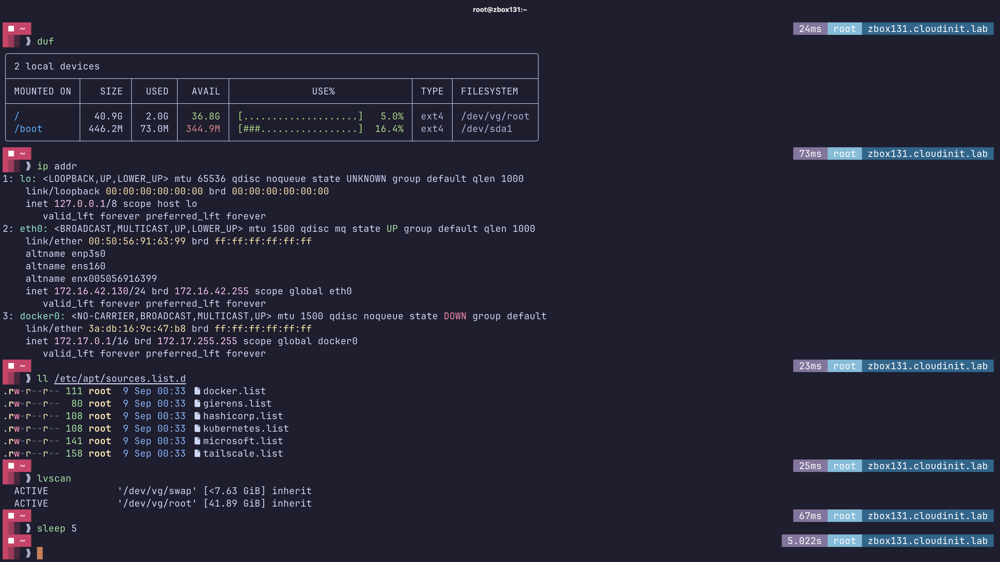
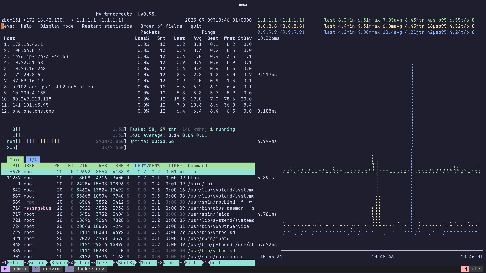
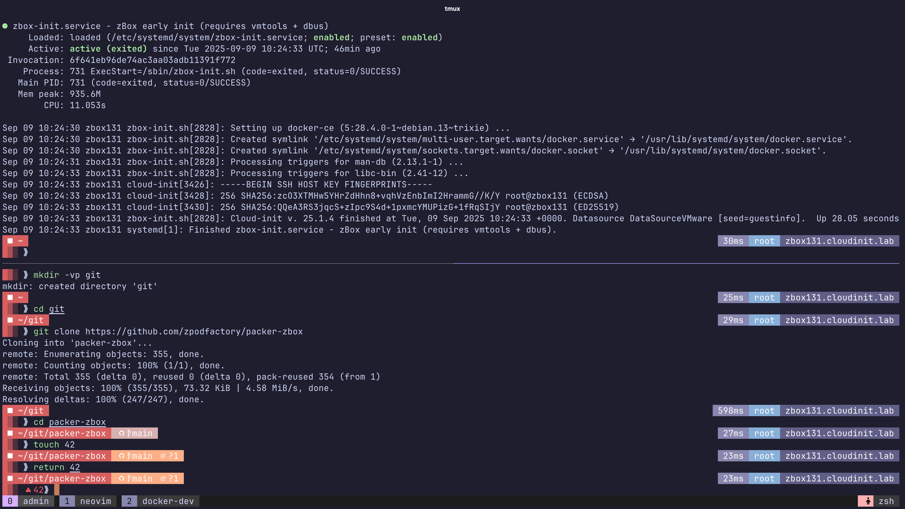
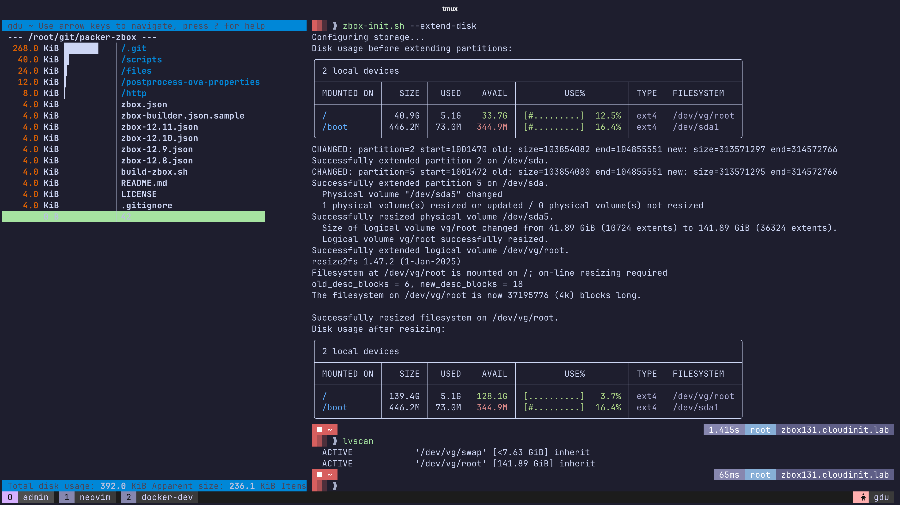
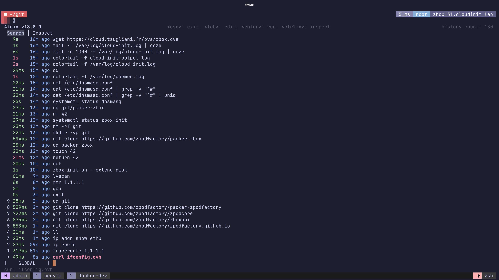

# zBox appliance

Based on Debian GNU Linux

Opinionated Linux Appliance setup for my personal use.

## Purpose

My personal *all-in-one* VM for dev and testing.

- Fancy zsh prompt shell (oh-my-zsh/posh/custom theme)
- Pre-configured apt sources lists for docker, kubernetes, hashicorp, tailscale, netbird, cloudflare tunnel
- LVM2 based storage configuration (`zbox-init.sh --extend-disk` will automatically extend the disk to the max size of the disk through lvm)
- Various misc tools

Easily deploy the appliance using the provided `OVF Properties` or `cloud-init` configuration.

## Downloads

Latest builds are available here:
- https://cloud.tsugliani.fr/ova/zbox-13.2.ova
- https://cloud.tsugliani.fr/ova/zbox-13.3.ova
- https://cloud.tsugliani.fr/ova/zbox-13.4.ova


## Deployment examples

For both examples we will be using the [govc](https://github.com/vmware/govmomi/releases) cli tool to deploy the appliance.

A basic configuration for govc is to export the appropriate variables in your shell environment.
For example I use the following `xyz.env` file:


```bash
export GOVC_URL="https://vc/sdk"
export GOVC_USERNAME="username"
export GOVC_PASSWORD="password"
export GOVC_INSECURE=true
export GOVC_DATACENTER="Datacenter"
export GOVC_DATASTORE="vsanDatastore"
```

This way I can source the file in my shell session and have the appropriate target environment ready to use through the `govc` cli tool. (easy to manage multiple target environments this way for quick testing)

```bash
source xyz.env
```

Then I can use the `govc` cli tool to deploy the appliance, either using the `OVF Properties` or the `cloud-init` configuration.

### OVF Properties Deployment

Sample configuration for OVF Properties deployment where it will setup the networking, the root password and ssh key.

`ovfproperties.json` (adapt to your environment):

```json
{
  "DiskProvisioning": "flat",
  "IPAllocationPolicy": "dhcpPolicy",
  "IPProtocol": "IPv4",
  "PropertyMapping": [
    {
      "Key": "guestinfo.hostname",
      "Value": "zbox"
    },
    {
      "Key": "guestinfo.ipaddress",
      "Value": "10.10.42.131"
    },
    {
      "Key": "guestinfo.netprefix",
      "Value": "24"
    },
    {
      "Key": "guestinfo.gateway",
      "Value": "10.10.42.1"
    },
    {
      "Key": "guestinfo.dns",
      "Value": "10.10.42.254"
    },
    {
      "Key": "guestinfo.domain",
      "Value": "ovfproperty.lab"
    },
    {
      "Key": "guestinfo.password",
      "Value": "zboxisamazing2025!"
    },
    {
      "Key": "guestinfo.sshkey",
      "Value": "ssh-rsa AAAAB3NzaC1yc2EAAAADAQABAAABAQC/i56xhpfJKBC9TaL4BlPP3eDY03Csf4aLIM4OkSGDlTwNbadu5doGb8x/Z7650xsxXTuDq22UEVv0fuklc3DCl3NP9yv27LNj54g9WZPrC0wlDZOblvQo52atjkh4SIYZp5Rn9FFY+Vwc5/c3widbZ8OrNynS4QkKWrZHfmrjzWR0ZwGZPgTNxRiD0db6XVfxAxr3MuTKEd2yKlWenS8+ZEKnjR1nhEC6awmkt8p/uNZvyKHcVQ4Goyeo6EKaJf5JtdSV6mnN0lL3URuvDefrJygFzTNqhu1bwiXQl/zG969HaAkNRA4FhM2BIziIjCAzXrmQoaY8+5bWDXJg3kdp root@zPodMaster"
    }
  ],
  "NetworkMapping": [
    {
      "Name": "VM Network",
      "Network": "Segment-Dev-Lab"
    }
  ],
  "MarkAsTemplate": false,
  "PowerOn": true,
  "InjectOvfEnv": true,
  "WaitForIP": false,
  "Name": null
}
```

> [!NOTE]
> the `PowerOn` flag is set to `true` and will automatically power on the VM after deployment.


```bash
govc import.ova -name zbox -options ovfproperties.json https://cloud.tsugliani.fr/ova/zbox-13.4.ova
```

Wait a moment for the VM to be uploaded, created and it should be available with the provided IP address/credentials from the `ovfproperties.json` file.

### Cloud-init Deployment

Sample configuration for cloud-init deployment where it will setup the networking and install docker packages, create an admin user named `zboxadmin` and set it in the sudoers file and docker groups.

`metadata.yaml` (adapt to your environment):

```yaml
instance-id: zbox
local-hostname: zbox

network:
  version: 2
  renderer: eni
  ethernets:
    eth0:
      addresses: [10.10.42.130/24]
      gateway4: 10.10.42.1
      nameservers:
        addresses: [10.10.42.11]
        search: [cloudinit.lab]

```

`user-data.yaml` (adapt to your liking):

```yaml
#cloud-config

hostname: zbox
fqdn: zbox.cloudinit.lab
manage_etc_hosts: true

users:
  - name: zboxadmin
    gecos: Admin User
    groups: [sudo, adm, docker]
    shell: /bin/bash
    sudo: "ALL=(ALL) ALL"
    lock_passwd: false
    passwd: ""

ssh_pwauth: true
chpasswd:
  expire: false
  list: |
    zboxadmin:zboxisamazing2025!

packages:
  - docker-ce
  - docker-ce-cli
  - containerd.io

package_update: true
package_upgrade: false
```

`cloudinit.json` (adapt "Network" to your environment):

```json
{
  "DiskProvisioning": "flat",
  "IPAllocationPolicy": "dhcpPolicy",
  "IPProtocol": "IPv4",
  "NetworkMapping": [
    {
      "Name": "VM Network",
      "Network": "Segment-Dev-Lab"
    }
  ],
  "MarkAsTemplate": false,
  "PowerOn": false,
  "InjectOvfEnv": true,
  "WaitForIP": false,
  "Name": null
}
```

> [!NOTE]
> the `PowerOn` flag is set to `false` and will not power on the VM after deployment as we are going to set the metadata and userdata next and then power on the VM through the `govc` cli tool.
> Also we are not setting ANY OVF Properties in this example as we are relying on cloud-init to handle the configuration.

A small script to help you deploy the appliance using the `cloud-init` configuration.

```bash
#!/bin/bash

# Export the metadata and userdata
export VM="zbox"
export METADATA=$(gzip -c9 <metadata.yaml | { base64 -w0 2>/dev/null || base64; })
export USERDATA=$(gzip -c9 <userdata.yaml | { base64 -w0 2>/dev/null || base64; })

# Import the OVA
govc import.ova -name $VM -options cloudinit.json https://cloud.tsugliani.fr/ova/zbox-13.4.ova

# Set the metadata and userdata
govc vm.change -vm "${VM}" \
 -e guestinfo.metadata="${METADATA}" \
 -e guestinfo.metadata.encoding="gzip+base64" \
 -e guestinfo.userdata="${USERDATA}" \
 -e guestinfo.userdata.encoding="gzip+base64"

# Power on the VM
govc vm.power -on ${VM}
```
Wait a moment for the VM to be uploaded, created and it should be available with the provided IP address/credentials with the provided cloud init `metadata.yaml` and `user-data.yaml` configurations.

## Screenshots

Some screenshots of the appliance using some of the installed tools.







## Packer setup

If you want to build and/or modify the appliance yourself, you can follow the below steps.

Set your `zbox-builder.json` file with the correct parameters from the provided example file.

```bash
cp zbox-builder.json.sample zbox-builder.json
```

Edit the required values in the `zbox-builder.json` file to reflect your builder environment.

```bash
vi zbox-builder.json
```
> [!WARNING]
> This step requires you to have a proper VMware ESXi environment prepared for packer to use.
> You can use [William Lam](https://williamlam.com) provided [Nested ESXi Virtual Appliances](https://brcm.tech/flings) to build the zBox appliance.

Then you can build the appliance using the provided `build-zbox.sh` script.

```bash
./build-zbox.sh
```
This should take around 15 minutes to build the appliance and find the OVA file in the `output-zbox-xyz` directory. (adapt to your version)

```bash
ls -l output-zbox-xyz/*.ova
```

